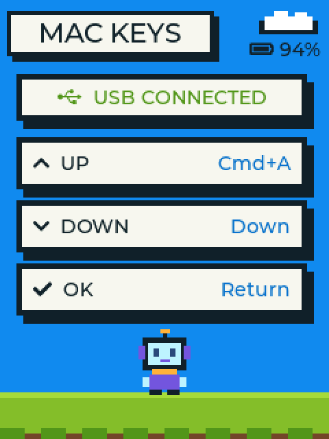
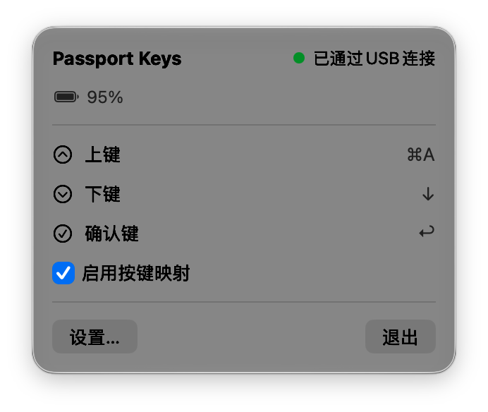
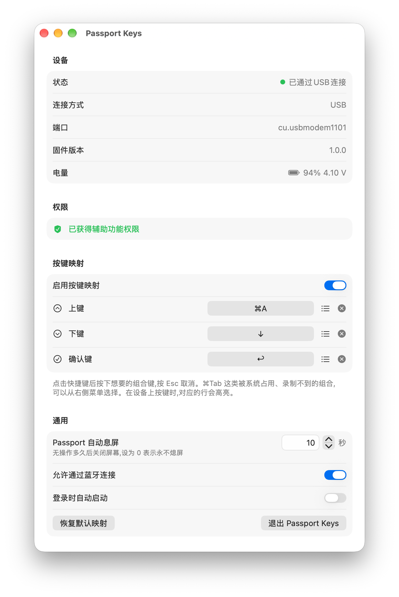

# Passport Keys

把 FoloToy AI Passport 的上、下、确认三个功能键变成 Mac 快捷键:在 Passport 上按下上键,Mac 就像按下了你设定的组合键(例如 ⌘A)。映射在 macOS app 里随时修改。

<p align="center">
  
  &nbsp;
  
</p>

<p align="center">
  
</p>

ESP32-C3 没有 USB OTG,Passport 不能直接当 USB 键盘。因此方案分两部分:固件把按键事件通过 USB 串口或低功耗蓝牙发给 Mac,Mac app 按映射合成键盘事件。

```text
Passport 按键(ADC 分压)
  -> 固件 pk_app:按下瞬间生成事件
  -> JSON Lines,经 USB Serial/JTAG 或 BLE GATT
  -> Mac app:握手、去重、查映射
  -> CGEvent 合成组合键 -> 当前前台 app
```

## 目录

| 路径 | 内容 |
| --- | --- |
| `firmware/` | 基于 [folotoy/ai-passport](https://github.com/folotoy/ai-passport)(f75873f,MIT)修改的固件,ESP-IDF 5.5.3 |
| `macos/` | Swift 原生 macOS 菜单栏 app(SwiftUI、IOKit、CoreBluetooth、CGEvent),无第三方依赖 |
| `docs/protocol.md` | 设备与 app 之间的通信协议 |
| `scripts/flash-firmware.sh` | 备份并烧录固件 |
| `.github/workflows/` | PR 检查与发布工作流 |
| `contrib/ci/` | 发布脚本:计算版本号、创建 GitHub Release |
| `docs/release.md` | 发布流程、签名配置与固件刷写说明 |

## 快速开始

不想自己编译时,可以从 [GitHub Releases](https://github.com/BlackHole1/passport-keys/releases) 下载 app 与固件,刷写方法见 [docs/release.md](docs/release.md)。下面是从源码编译的步骤。

### 1. 烧录固件

需要 ESP-IDF v5.5.3(默认路径 `~/esp/esp-idf-v5.5.3`)。Passport 开机后用支持数据传输的 USB-C 线连接 Mac:

```bash
./scripts/flash-firmware.sh
```

脚本会:

1. 检查 Passport Keys app 没有占用串口(占用时请先从菜单栏退出 app)。
2. 编译固件。
3. 首次烧录某台设备时,把整片 8 MB Flash 备份到 `~/esp/passport-backups/passport-<MAC>-flash.bin`。
4. 用 `idf.py flash` 分段烧录,不擦除整片 Flash,不写受保护的 `cardid` 分区。

恢复原固件:

```bash
source ~/esp/esp-idf-v5.5.3/export.sh
python -m esptool --chip esp32c3 -p /dev/cu.usbmodemXXXX write_flash 0 ~/esp/passport-backups/passport-<MAC>-flash.bin
```

备份文件包含设备身份数据,不要上传或分享。

### 2. 编译并运行 app

需要 Xcode 与 [XcodeGen](https://github.com/yonaskolb/XcodeGen)(`brew install xcodegen`)。

```bash
cd macos
./scripts/build.sh          # 产物:macos/build/PassportKeys.app
open build/PassportKeys.app
```

工程由 `macos/project.yml` 生成,默认用 Apple Development 证书(团队 `6N2J645XLG`)签名。没有该证书时使用 `SIGN_IDENTITY=- ./scripts/build.sh` 改为 ad-hoc 签名,但每次重新编译后都需要重新授予辅助功能权限。

### 3. 授权与设置

1. 首次启动会打开设置窗口。按提示在 系统设置 > 隐私与安全性 > 辅助功能 中打开 Passport Keys,状态会自动刷新。
2. 第一次需要蓝牙时,系统会请求蓝牙权限。
3. 在"按键映射"里点击快捷键框,按下想要的组合键即可;按 Esc 取消录制。⌘Tab、⌘空格 这类被系统占用、录制不到的组合,可以从右侧菜单选择。
4. 在 Passport 上按键时,设置窗口里对应的行会高亮,方便确认。

## Mac app 功能

- 菜单栏常驻:显示连接状态、电量、三个键的映射,可以一键暂停映射。
- 快捷键录制:支持 ⌃⌥⇧⌘ 任意组合,以及方向键、翻页、F 键等特殊键;提供常用按键菜单、清除、恢复默认。
- 连接:USB 优先,拔掉线后自动改用蓝牙;断线、设备重启、固件无响应时自动重连。
- 只连接刷了 Passport Keys 固件的设备:其它 ESP32 串口握手失败后会被忽略。
- 映射实时同步到 Passport 屏幕显示。
- Passport 自动息屏:默认空闲 10 秒熄屏,设为 0 表示永不熄屏。
- 登录时自动启动(可选)。
- 默认映射:上键 ↑,下键 ↓,确认键 ↩。

## 固件行为

- 屏幕显示连接状态(`WAITING FOR MAC` / `USB CONNECTED` / `BLE CONNECTED`)、三个键当前映射和电量;按键时对应行高亮。
- 按下瞬间发送事件,一次按压只触发一次快捷键。
- 空闲超过设定时间后熄屏(默认 10 秒,在 app 中修改,设为 0 永不熄屏);按键会点亮屏幕,这次按键照常生效。
- 蓝牙名称 `Passport Keys`,单连接、无配对。

详细说明见 `firmware/docs/passport-keys.zh_CN.md`,协议见 `docs/protocol.md`。

## 开发与测试

```bash
# Mac app 单元测试:协议解析、行组帧、去重、快捷键格式化、设置持久化
cd macos && ./scripts/test.sh

# 固件:仓库检查 + 主机测试(含 pk_protocol),以及完整固件门禁
cd firmware
source ~/esp/esp-idf-v5.5.3/export.sh
./tools/validate.sh --static
./tools/validate.sh --firmware
```

查看 app 运行日志(zsh 内置了同名的 `log` 命令,所以写全路径):

```bash
/usr/bin/log stream --level info --predicate 'subsystem == "cc.bugs.PassportKeys"'
```

## 持续集成与发布

每个 Pull Request 会运行 PR Check:固件静态检查与主机测试、macOS app 单元测试与 Release 编译、ESP-IDF 固件编译与分区校验。

发布参照 [oo-cli](https://github.com/oomol-lab/oo-cli) 的流程:在 Actions 中手动运行 Publish,填写版本号或选择递增方式。工作流会注入版本号编译 macOS app(配置 Developer ID secrets 后签名并公证)、以同一版本号编译固件,再创建 GitHub Release 并自动生成更新说明。步骤、签名所需 secrets 与固件刷写注意事项见 [docs/release.md](docs/release.md)。

## 验证记录

2026-09-10 在一台 Passport(ESP32-C3,8 MB Flash)上验证:

| 类别 | 结果 |
| --- | --- |
| 编译 | 固件 `idf.py build` 通过,应用分区剩余 69%;Mac app Release 编译通过 |
| 主机测试 | 固件 `validate.sh --static` 通过(含 `pk_protocol` 测试与受保护分区布局检查);Mac app 19 个单元测试通过 |
| 真机测试 | 烧录前完成整片备份;app 打开串口不会让设备重启;app 启动后约 0.4 秒完成 USB 握手;三个键经 USB 与 BLE 都注入了正确的按键(⌘A、↓、↩),没有重复触发;屏幕正确显示映射(`Cmd+A`、`Down`、`Return`);拔掉 USB 后约 1.5 秒切到蓝牙(改为快速广播前是 2.5 到 7.4 秒),插回后约 0.4 秒切回 USB |
| 未验证 | 拔线后屏幕状态切换的具体耗时;自动息屏时序;登录时自动启动;全新 Mac 上的首次蓝牙授权流程;长时间运行的耗电 |

## 常见问题

| 现象 | 处理 |
| --- | --- |
| 设置里提示"已忽略未刷入 Passport Keys 固件的串口" | 设备还是出厂固件,先运行 `scripts/flash-firmware.sh` |
| 烧录时提示串口被占用 | 从菜单栏退出 Passport Keys app 后重试 |
| 拔插 USB 的瞬间按键没反应 | 链路切换需要约 1.5 秒,期间的按键不会缓存补发,避免快捷键延迟触发;等菜单栏显示已连接后再按 |
| 按键有反应但 Mac 没有动作 | 检查辅助功能权限;确认"启用按键映射"已打开;密码输入框等安全输入状态下系统会拦截合成按键 |
| 找不到设备 | 确认 Passport 已开机(长按电源键 0.5 秒);USB 线支持数据传输;或确认 Mac 蓝牙已开启且 app 已获得蓝牙权限 |
